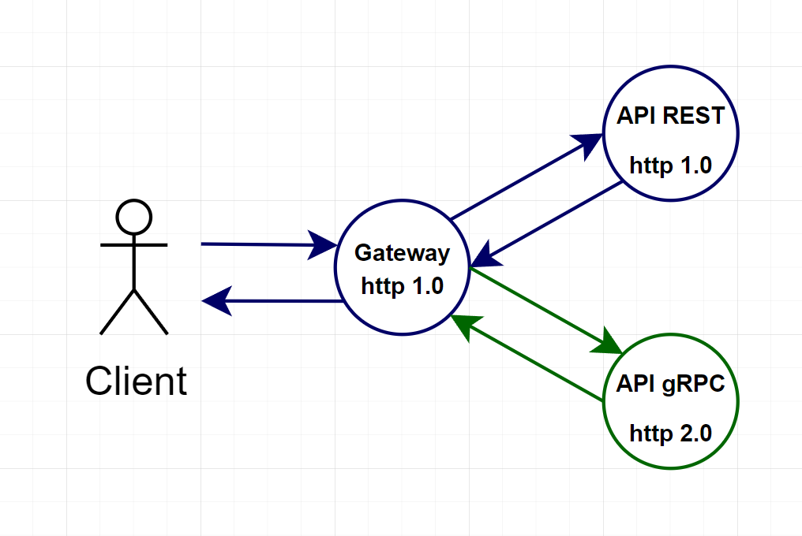

<h1 align="center"> 📊 grpc-performance-test 🚀 </h1>

Application to test the performance difference between rest and grpc

  
## 📉 Diagrama do processo de requisições

  

  
## 🤯 Desafios
✅ Construir as aplicações  
⬜️ Planejar um bom relatório de análise de diferença de performance  
⬜️ Como é realizado o tratamento de erros ?  

  
## 📄 Relatório
O relatório deve fornecer informações de diferenças de performance e números de requisições entre os protocolos REST e gRPC

O relatório consistirá nos seguintes testes:
<ul>
  <li>100 requisições feitas simultaneamente por apenas um usuário, com payload baixo, quem conseguir realizar as requisições em menos tempo ganha</li>
  <li>100 requisições feitas simultaneamente por apenas um usuário, com payload alto, quem conseguir realizar as requisições em menos tempo ganha</li>
  <li>1000 requisições feitas por 10 usuários simultâneos, com payload médio, com um tempo máximo de 30 segundos, quem conseguir responder o maior número de requisições ganha</li>
  <li>1000 requisições feitas por 10 usuários simultâneos, com payload alto, com um tempo máximo de 1 minuto, quem conseguir responder o maior número de requisições ganha</li>
</ul>